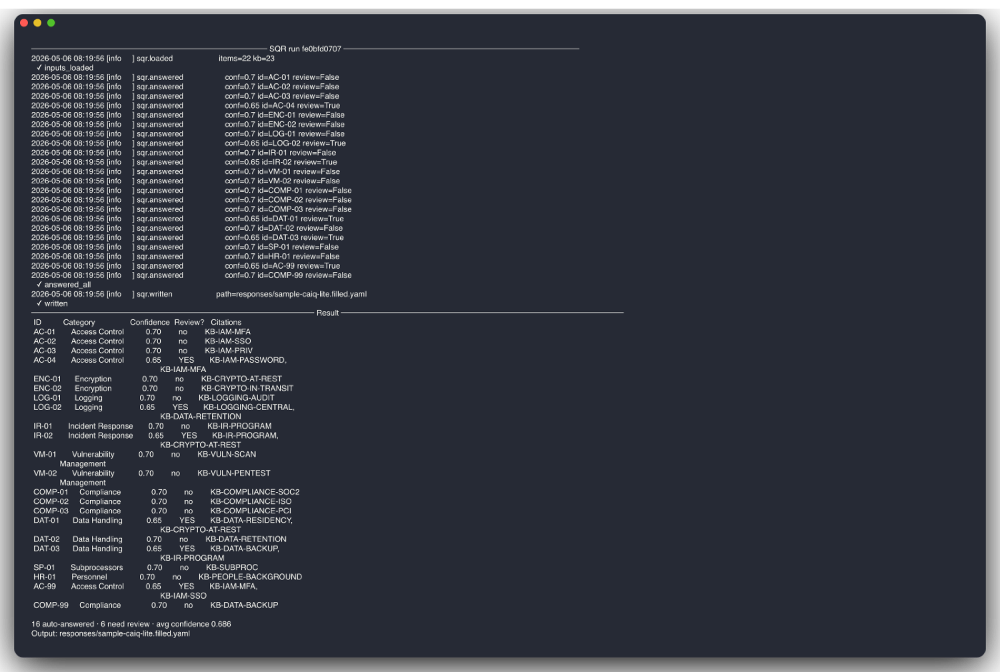
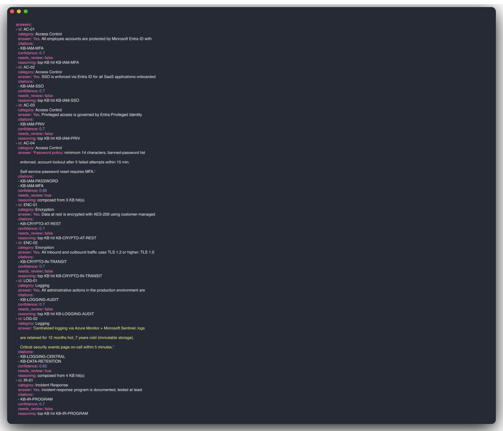

# security-questionnaire-responder

[](https://github.com/anthonyonazure/security-questionnaire-responder/actions/workflows/tests.yml)
[](https://www.python.org/)
[](https://github.com/langchain-ai/langgraph)
[](LICENSE)

LangGraph agent that auto-answers vendor security questionnaires (CAIQ, SIG, Excel templates) from a curated knowledge base, with **citations and confidence scores** so reviewers know exactly which claims need human review and which are safe to send.

### How a 22-question CAIQ-Lite gets answered in seconds



Each answer carries a citation back to a specific knowledge-base entry, plus a confidence score. The two intentionally hard questions (FedRAMP and post-merger orphan accounts) are correctly flagged for human review:



## Why this is different from "let an LLM fill the spreadsheet"

- **Every answer cites the specific KB entries it used.** Reviewers can trace every claim back to a source statement. No vibe-based answers.
- **Confidence is explicit.** Below the human-review threshold (default 0.7), the cell is highlighted yellow in the output XLSX and tagged `needs_review=yes`.
- **The agent refuses to fabricate.** If retrieval surfaces nothing relevant, it returns `(no knowledge-base support — needs human review)` rather than guessing.
- **Knowledge base is YAML, not embeddings.** Versioned, diffable, owned in code review. Embeddings can be added later as a reranker.

## Architecture

```
load_inputs (questionnaire + KB)
       │
       ▼
answer_all (parallel per item):
   retrieve(question, KB) → top-k entries (lexical + topic-tag)
   answer_item(question, hits) → {answer, citations, confidence, needs_review}
       │
       ▼
write_output → filled.yaml + filled.json + filled.xlsx (highlighted)
```

## Quick start

```bash
cd ../b2b-agent-toolkit && pip install -e ".[dev]" && cd -
pip install -e ".[dev]"
cp .env.example .env          # leave ANTHROPIC_API_KEY blank for stub mode

# Run against the sample CAIQ-Lite-style questionnaire
sqr run --questionnaire samples/sample-caiq-lite.xlsx.yaml

# Real Excel questionnaire
sqr run --questionnaire /path/to/their-CAIQ-v4.xlsx --kb knowledge_base/your_co.yaml
```

## Output

```
responses/
├── sample-caiq-lite.xlsx.filled.yaml    # canonical machine-readable
├── sample-caiq-lite.xlsx.filled.json    # same data, JSON
└── sample-caiq-lite.xlsx.filled.xlsx    # the original spreadsheet, with
                                         #   answer / citations / confidence /
                                         #   needs_review columns appended.
                                         #   Rows below confidence threshold
                                         #   are highlighted yellow.
```

The reviewer's workflow becomes: **open the xlsx, scan the yellow rows, fix or sign off**. Everything green is safe to forward.

## Layout

```
knowledge_base/cyber_co.yaml      # 22 KB entries covering ~80% of typical questionnaires
samples/sample-caiq-lite.xlsx.yaml  # 22-question demo input (2 intentionally hard)
src/sqr/
├── state.py              # LangGraph state
├── graph.py              # load → answer-all → write
├── nodes.py              # ↑ implementations
├── retrieval.py          # lexical + topic-tag KB retrieval
├── answering.py          # LLM answer composition with stub fallback
├── io.py                 # YAML + XLSX read/write
└── cli.py                # `sqr run --questionnaire <file>`
```
